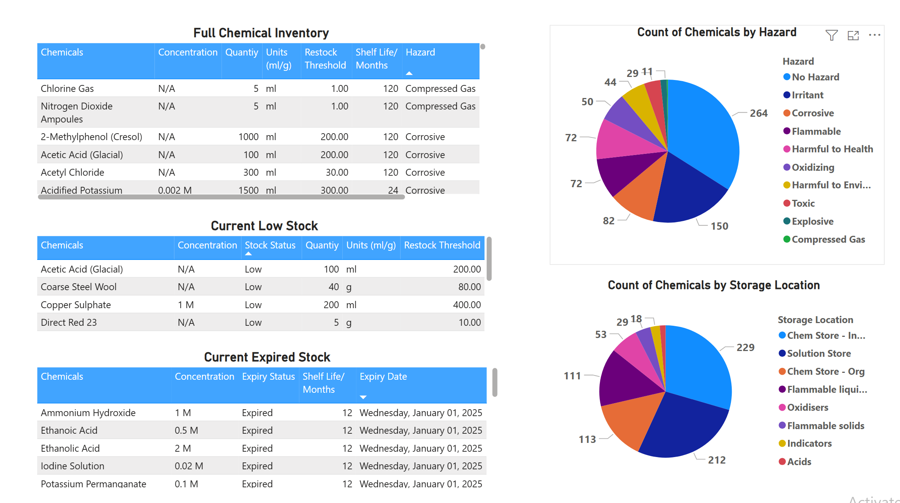

# 🧪 Chemical Inventory Management Dashboard (Power BI)

This project showcases a dynamic Power BI dashboard built to manage and monitor a large chemical inventory. Designed for use in a school science department, the dashboard improves data visibility, tracks hazardous substances, and supports safe storage and compliance practices.

## 📊 Features

- Total inventory overview with interactive filters (e.g., storage location, supplier)
- Breakdown of chemicals by hazard classification (GHS pictograms, signal words)
- Expiry date tracking with alert visual
- Filterable tables and charts for efficient auditing and reordering
- Supports data-driven stock management and safety compliance

## 🛠 Tools Used

- Power BI Desktop
- Excel for data preparation
- GHS data and COSHH classification references

## 🖼️ Dashboard Overview
This Power BI dashboard provides a clear and interactive view of a large chemical inventory, designed for use in a science department or laboratory setting. It includes visual summaries of hazard classifications, chemical stock levels, expiry tracking, and supplier distribution.

### Filtering for Flammble Chemicals 
This view demonstrates the use of interactive filters to isolate all chemicals classified as *Flammable*. It allows users to focus on substances with specific hazards and helps ensure proper storage and handling according to COSHH guidelines.
.png)

### Filtering for Chem Store Location 
This filtered view shows only the chemicals located in the **Chem Store**. The location-based filtering makes it easy to conduct physical stock checks, identify storage risks, and manage audit readiness.

.png)

## 📁 Files Included

[📥 Download Chemical-Inventory-Dashboard.pbix](Chemical-Inventory-Dashboard.pbix) - the Power BI dashboard file
- `data/example_chemical_data.csv` – sample (anonymised) dataset
- `screenshots/` – visuals from the dashboard

## 🔍 Use Cases

- School/University lab inventory management
- COSHH compliance tracking
- Safe storage and chemical audit preparation

## 📄 License

This project is open-source under the MIT License. See `LICENSE` for details.

---
